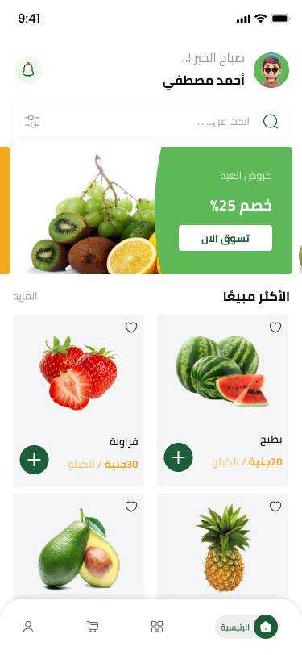
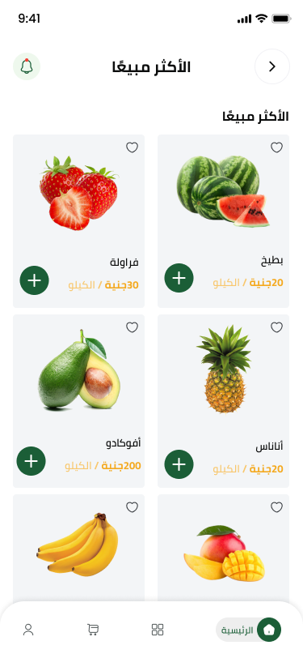
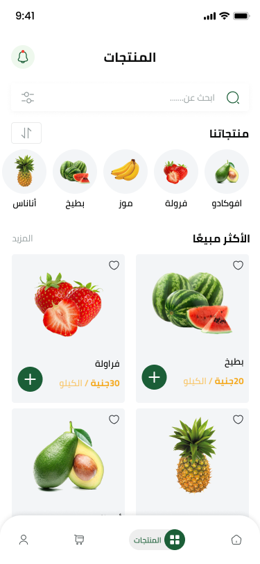
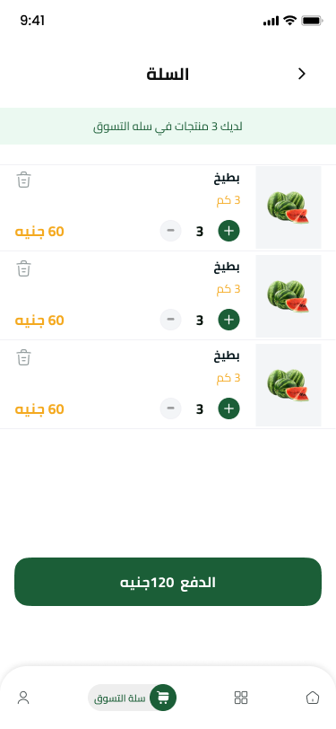
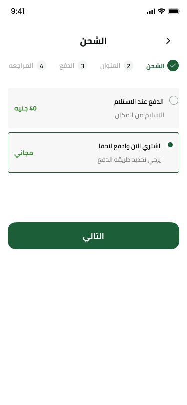

# Fruit Hub

A Flutter mobile app for a fresh fruit marketplace.

## Overview

Fruit Hub is a comprehensive mobile application built with Flutter, designed to connect fruit lovers with fresh produce directly from local vendors. It provides an intuitive interface for browsing, ordering, and tracking fruit deliveries, while offering robust management tools for sellers. This app is for anyone looking to buy or sell fresh fruit with convenience and efficiency.

## Features

- **Order Management:** View, manage, and track your fruit orders.
- **Secure Payments:** Easy and secure in-app payment processing.
- **Vendor Profiles:** Browse and select from various local fruit vendors.
- **Order History:** Access a complete history of all past purchases.
- **User Authentication:** Secure login for customers and vendors.

## Screenshots

| Screenshot 1 | Screenshot 2 | Screenshot 3 | Screenshot 4 |
| :---: | :---: | :---: | :---: |
|  |  |  |  |

| Screenshot 5 | Screenshot 6 | Screenshot 7 | Screenshot 8 |
| :---: | :---: | :---: | :---: |
|  |  |  |  |

## Dashboard

A dashboard for managing the application is also available. You can find the repository here:

[Fruit Hub Dashboard](https://github.com/colonal/fruit-hub_dashboard)

## Getting Started

### Installation

1.  **Clone the repository:**
    ```sh
    git clone https://github.com/colonal/fruit-hub.git
    ```
2.  **Navigate to the project directory:**
    ```sh
    cd fruit-hub
    ```
3.  **Install dependencies:**
    ```sh
    flutter pub get
    ```

### Usage

1.  Ensure you have a connected device (physical or emulator).
2.  Run the app:
    ```sh
    flutter run
    ```

## Technologies Used

- **Framework:** [Flutter](https://flutter.dev/)
- **Programming Language:** [Dart](https://dart.dev/)
- **State Management:** (e.g., Provider, BLoC - please specify)
- **Backend / API:** Firebase

## Folder Structure

A brief overview of the project's folder structure:

```
fruit-hub/
├── android/              # Android specific files
├── ios/                  # iOS specific files
├── lib/                  # Main application source code
│   ├── main.dart         # App entry point
│   ├── core/             # Core components (services, models, utils)
│   ├── features/         # Feature-based modules
│   ├── constants.dart    # App-wide constants
│   ├── l10n/             # Localization files
│   └── generated/        # Generated files
├── test/                 # Test files
└── pubspec.yaml          # Project dependencies
```
